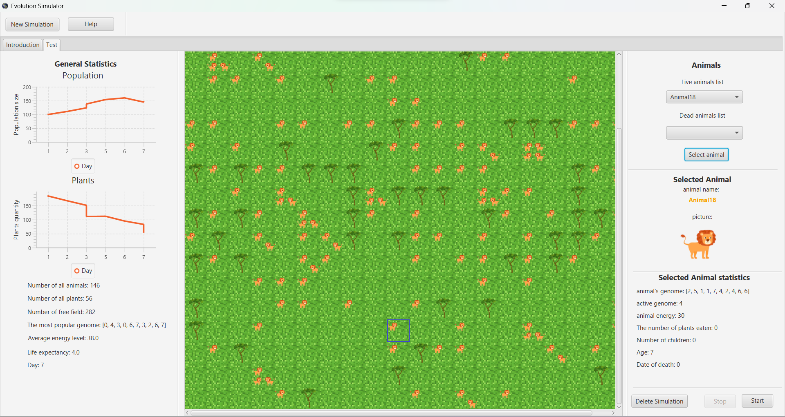

# Evolution Simulator

## Description

Evolution Simulator is a program that allows you to simulate the evolution of animal populations. The program allows you to configure many variants and parameters of the simulation, as well as to observe changes in the population over time using graphs, and also to track a single animal.

[full description (in polish)](https://github.com/bartipablo/evolution-simulator/tree/master/full-description)

## Technologies

- Java 17
- JavaFX
- JUnit
- Gradle

## Setup

To run this project, type in terminal:

```
 cd evolution-simulator
 gradle run
```

## Preview

[YouTube preview](https://www.youtube.com/watch?v=ncTL2mW9i1c&list=PLcTxPGo7EwPSk2s6yrAJNdqyRG1AVIreJ)


